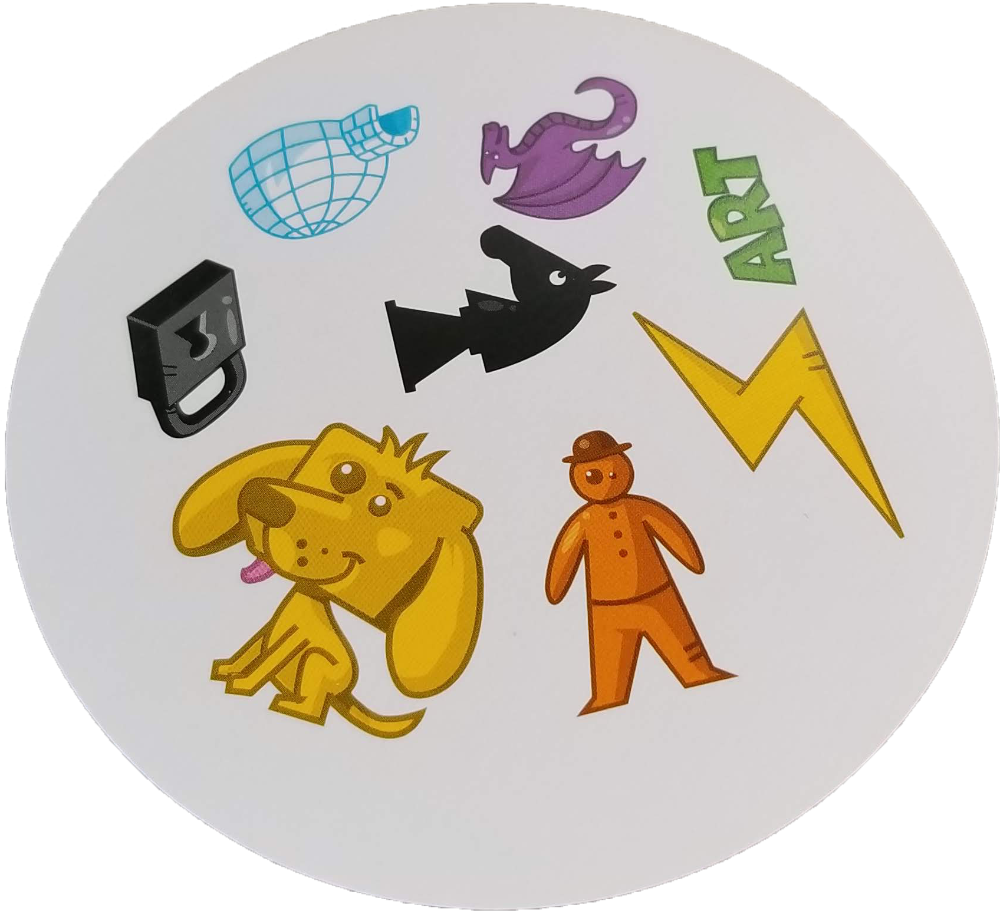
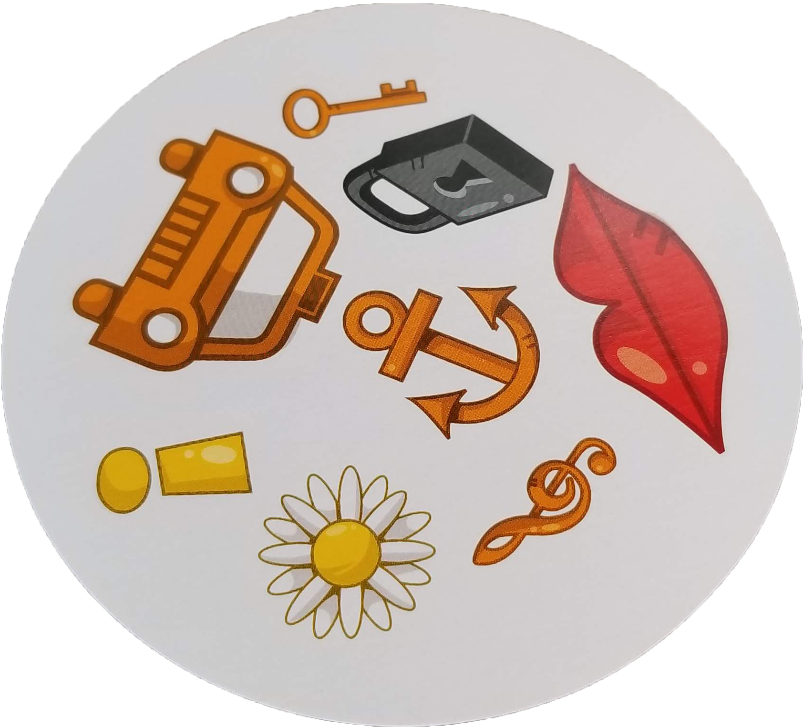

#  App From Scratch

## Submission Instructions
* Fork this repo
* Submit your work on Canvas

## Resources
* [Spot-It Demo](http://www.blueorangegames.com/nhl/)
* This repo contains images for each card under `assets/` if you choose to use
  those

## Feature Tasks
Create an application that mimics the game Spot-It. At minimum your app should
present users with two sets of symbols where the sets only share one symbol in
common. The user must identify what symbol is contained in both sets and
receive some reward in the form of a score.

* Practice identifying isolated features of an app.
* Practice building isolated implementations of of different features.
* Practice wiring isolated features together after they've been individually
  developed.
* Practice keeping a clear seperation between "business logic" and
  presentation. Your UI layer should be responsible for displaying
  the state of the app and receiving input for the app. Actual
  changes to the state of the app should happen in modules seperate from
  UI.

## Textual Implementation
Consider this minimal implementation of the game without using images.
you could generate two columns of words or symbols (with the set constraints)
and have the user click on the symbol repeated in the two sets.

```
igloo          padlock
dragon         lips
art            anchor
lightning      music-note
knight         flower
man            exclamation-point
dog            car
padlock        key
```

If you build a simple textual implementation first then it will be easier
to make, easier to reason about and you'll have already achieved MVP.

## Visual Implementation
Consider the changes that would need to be made between the textual
implementation and a visual implementation. If each of the words before were
buttons that you could attach click handlers to, how will you now map where
users click in an image and turn that click into an identifying symbol?

<p>


</p>

## Stretch Goals
* Design your app so it tracks scores for multiple people.
* Design your app with socket.io so multiple people can play it simultaneously.

